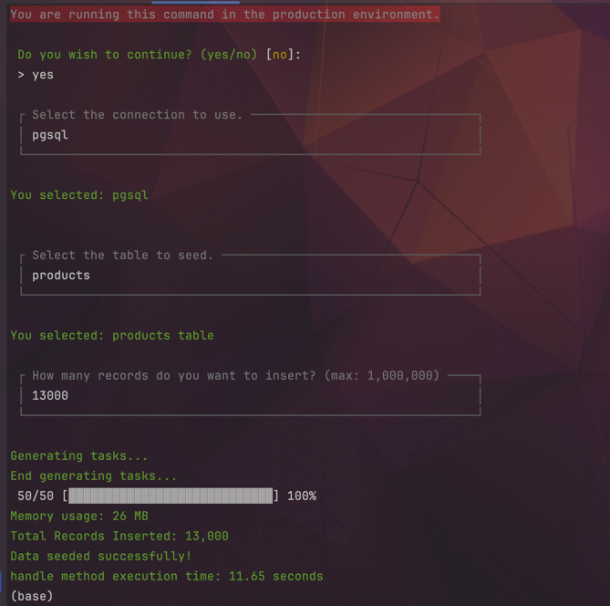

# Insert massive amount of data to a db

[](https://packagist.org/packages/elminson/massive-seeder)
[](https://github.com/elminson/massive-seeder/actions/workflows/run-tests.yml)
[](https://packagist.org/packages/elminson/massive-seeder)

Insert a massive amount of data to a db

## Installation

You can install the package via composer:

```bash
composer require elminson/massive-seeder
```
(Only postgreSQL is supported 100% at the moment)
## Usage

```php
php artisan db:massive-seeder

```



- [Elminson De Oleo Baez](https://github.com/elminson)
- [All Contributors](../../contributors)

## License

The MIT License (MIT). Please see [License File](LICENSE.md) for more information.
